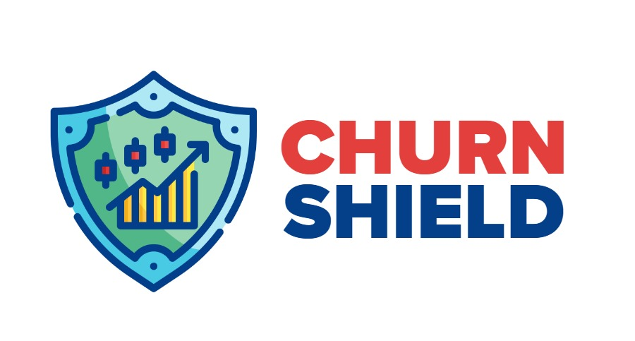
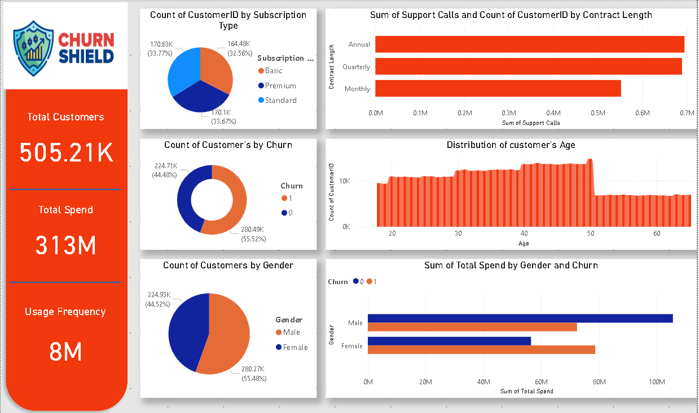

# 🛡️ Churn Shield - Customer Churn Prediction App

<div align="center">
  
  
  
  
</div>

<div align="center">
  
</div>

## 🎬 See It in Action
Watch a 30-second demo of Churn Shield's 3 core pages:  
[](https://youtu.be/dOPVO60x3w4)  
*(Click to play video)*
## 📊 Overview

**Churn Shield** is an intelligent customer churn prediction application built with Streamlit and machine learning. It helps businesses identify customers who are likely to discontinue their services, enabling proactive retention strategies.

### 🎯 Key Features

- **🔮 Smart Predictions**: Predict customer churn with high accuracy using Random Forest classifier
- **📈 Visual Insights**: Comprehensive data visualization and customer behavior analysis
- **🎛️ Interactive Interface**: User-friendly web interface for easy data input and results
- **📊 Real-time Analytics**: Instant prediction results with confidence scores

## 🚀 Demo

The application provides three main sections:

1. **🏠 Home**: Introduction and dataset information
2. **🔍 Insights**: Visual analysis of customer behavior patterns
3. **🎯 Predict**: Interactive prediction tool for individual customers

## 📊 Power BI Dashboard 


## 🛠️ Technology Stack

- **Frontend**: Streamlit
- **Machine Learning**: scikit-learn (Random Forest Classifier)
- **Data Processing**: Pandas, NumPy
- **Visualization**: Matplotlib, Seaborn
- **Model Persistence**: Pickle

## 📋 Prerequisites

Before running the application, ensure you have Python 3.8+ installed on your system.

## ⚡ Quick Start

### 1. Clone the Repository
```bash
git clone https://github.com/mustafarezk12/churn-shield.git
cd churn-shield
```

### 2. Install Dependencies
```bash
pip install -r requirements.txt
```


### 3. Run the Application
```bash
streamlit run app.py
```

The application will open in your default web browser at `http://localhost:8501`

## 📦 Installation

Create a `requirements.txt` file with the following dependencies:

```txt
streamlit>=1.28.0
pandas>=1.5.0
numpy>=1.24.0
scikit-learn>=1.3.0
matplotlib>=3.6.0
seaborn>=0.12.0
streamlit-option-menu>=0.3.6
```

## 🎮 How to Use

### Making Predictions

1. Navigate to the **Predict** tab
2. Enter customer details:
   - **Age**: Customer's age (0-120)
   - **Gender**: Male or Female
   - **Tenure**: Months with the company (0-100)
   - **Usage Frequency**: Monthly usage count
   - **Support Calls**: Monthly support interactions
   - **Payment Delay**: Days of payment delay
   - **Subscription Type**: Basic, Standard, or Premium
   - **Contract Length**: Monthly, Quarterly, or Annual
   - **Total Spend**: Customer's total expenditure
   - **Last Interaction**: Days since last contact

3. Click **Predict** to get instant results with confidence scores

### Viewing Insights

The **Insights** section provides:
- Customer demographic distributions
- Subscription and contract analysis
- Support call patterns
- Interactive dashboard visualizations

## 📊 Dataset Features

The model uses 12 key features to predict customer churn:

| Feature | Description |
|---------|-------------|
| `CustomerID` | Unique customer identifier |
| `Age` | Customer age |
| `Gender` | Customer gender |
| `Tenure` | Months as customer |
| `Usage Frequency` | Monthly usage count |
| `Support Calls` | Monthly support contacts |
| `Payment Delay` | Payment delay in days |
| `Subscription Type` | Service tier |
| `Contract Length` | Contract duration |
| `Total Spend` | Total customer expenditure |
| `Last Interaction` | Days since last contact |
| `Churn` | Target variable (0/1) |

## 🧠 Model Performance

- **Algorithm**: Random Forest Classifier
- **Features**: 10 input features (excluding CustomerID and Churn)
- **Preprocessing**: Standardization using mean and standard deviation
- **Output**: Binary classification with probability scores

## 🎨 User Interface

The application features:
- **Responsive Design**: Works on desktop and mobile devices
- **Interactive Navigation**: Easy-to-use horizontal menu
- **Visual Feedback**: Color-coded prediction results
- **Professional Styling**: Clean and modern interface

## 📁 Project Structure

```
churn-shield/
├──Dataset
|    ├── customer_churn_dataset-testing-master.csv
|    ├── customer_churn_dataset-training-master.csv
|
├──EDA&ML-MODel
     ├── Full_Customer_Churn(1).ipynb  # EDA & Trained/test ML model
├── Streamlit  # Main Streamlit application
|___ |___ app.py
|    |___ model(1).pkl # Trained ML model
|    |___ exported_data.csv  # Training dataset
|    |___ mean_std_values.pkl # Normalization parameters
|    |___ requirements.txt     # Python dependencies
├── images
|   ├── LOGO.jpg             # Application logo
|   ├── image.png            # Prediction page image
|   ├── dash.PNG             # Dashboard screenshot
└── README.md            # Project documentation
```

## 🤝 Contributing

Contributions are welcome! Please feel free to submit a Pull Request. For major changes, please open an issue first to discuss what you would like to change.

1. Fork the repository
2. Create your feature branch (`git checkout -b feature/AmazingFeature`)
3. Commit your changes (`git commit -m 'Add some AmazingFeature'`)
4. Push to the branch (`git push origin feature/AmazingFeature`)
5. Open a Pull Request

## 📝 License

This project is licensed under the MIT License - see the [LICENSE](LICENSE) file for details.

## 👥 Authors

- **Your Name** - *Initial work* - [YourGitHub](https://github.com/mustafarezk12)

## 🙏 Acknowledgments

- Dataset providers for the customer churn data
- Streamlit team for the amazing framework
- scikit-learn contributors for the machine learning tools

## 📞 Support

If you have any questions or run into issues, please:
1. Check the [Issues](https://github.com/mustafarezk12/churn-shield/issues) page
2. Create a new issue if your problem isn't already reported
3. Provide detailed information about your environment and the issue

---

<div align="center">
  <p>Made with ❤️ and Python</p>
  <p>⭐ Star this repository if you found it useful!</p>
</div>
