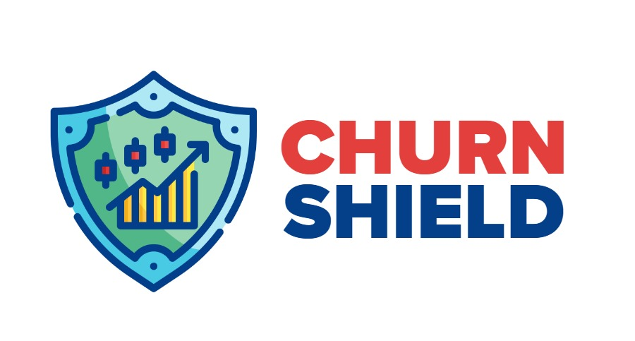

<div align="center">
   
</div>

<h1 align="center">🔮 Churn Shield: AI-Powered Customer Retention Platform</h1>

<p align="center">
  <a href="https://churn-shield-web-app-7uedcipufbvf8vz2tbaq5h.streamlit.app/">
    
  </a>
  <a href="https://python.org/">
    
  </a>
  <a href="LICENSE">
    
  </a>
</p>

---

## 🎬 See It in Action
Watch a 30-second demo of Churn Shield's 3 core pages:  
[](https://youtube.com/watch?v=YOUR_VIDEO_ID)  
*(Click to play video)*

---

## 🚀 About This App
**Churn Shield** empowers B2B companies to:
- **Predict customer churn** in real-time using machine learning
- **Analyze retention risks** through an interactive dashboard
- **Make data-driven decisions** with stakeholders

### Key Features:
- 📊 **Realtime Prediction**: Instant churn risk scoring for customers
- 📈 **Insights Dashboard**: Visualize trends in customer behavior
- 🛠️ **Decision Tools**: Exportable reports for stakeholder collaboration

---

## ❓ Why Predict Customer Churn?
- 💸 **Cost Efficiency**: Acquiring new customers costs 5-25x more than retaining existing ones
- 🚨 **Early Warnings**: Identify at-risk customers before they leave
- 📉 **Revenue Protection**: Proactively address retention risks

---

## 📂 About the Dataset
**12 features** from a B2B SaaS platform, including:
| Feature | Description |
|---------|-------------|
| `CustomerID` | Unique identifier |
| `Age` | Customer age |
| `Tenure` | Months with the company |
| `Payment Delay` | Days delayed in payments |
| `Total Spend` | Lifetime spending |
| `Churn` | **Target**: 1 (churned) / 0 (active) |  
*Full list: Gender, Usage Frequency, Support Calls, Subscription Type, Contract Length, Last Interaction*

---

## 🛠️ Technical Overview
### Installation
```bash
git clone https://github.com/yourusername/churn-shield.git
cd churn-shield
pip install -r requirements.txt
streamlit run app.py